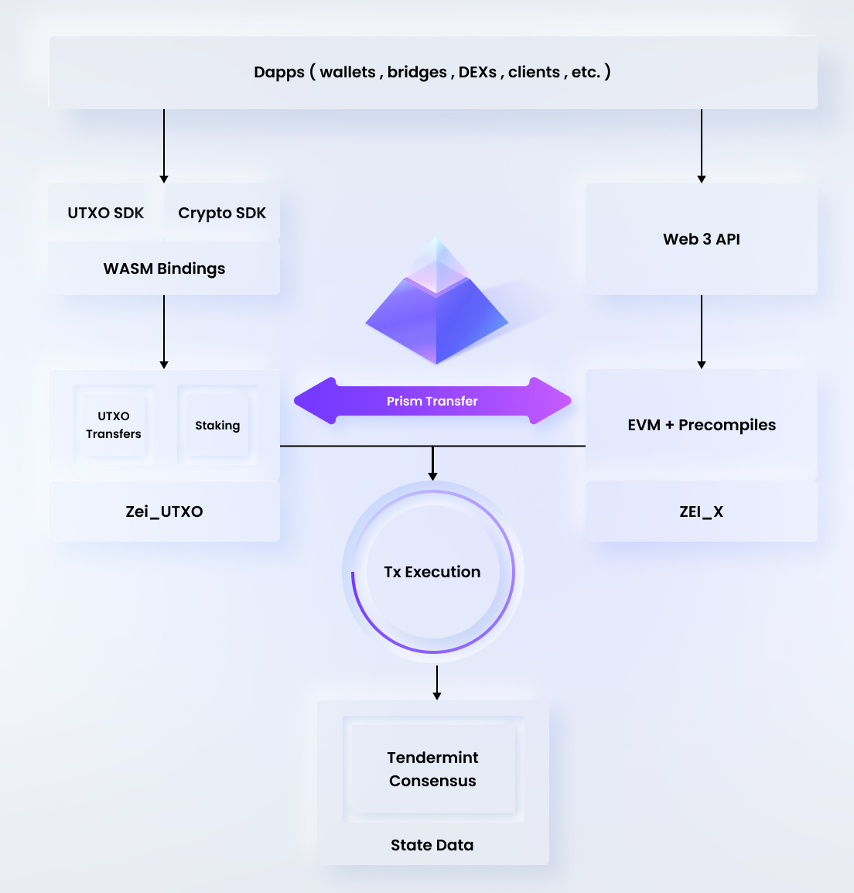

# Introduction
Founded in 2017, Findora is an open, permissionless blockchain featuring programmable privacy features. The blockchain is secured by a decentralized network of global validators running the Tendermint consensus mechanism.

With Findora, developers can create digital assets, applications and smart contracts which can preserve confidential information using advanced cryptography. Findora supports zero-knowledge proof cryptography and multi-party computation technologies to enable developers to build privacy-focused applications.

In addition to building your own privacy-focused blockchain applications, Findora’s primitives can be combined to create a programmable privacy layer to service any layer 1 blockchain such as Ethereum, Solana, etc. Essentially, Findora can serve as a layer 2 to scale Ethereum privacy via its private cross-chain transfer capabilities.

### Why Privacy and Why Findora?
Innovative blockchain technologies such as Bitcoin and Ethereum lack privacy features and publicly expose all transaction and user data. These fully transparent blockchains simply can’t serve many industries, such as health care and financial securities, where maintaining user privacy is operationally critical. For example, healthcare records, with user names and medical treatments data, and financial settlement of securities, containing proprietary settlement flow data firms wish to keep confidential, simply can’t run on transparent blockchains due to competitive or regulatory reasons.

Even in the less regulated niches of these industries where blockchain apps have launched, the lack of privacy limits the usability of these applications. For example, decentralized exchanges running on transparent blockchains lead users to suffer the front-running of their orders and a blockchain DAO bidding on a project suffers because it can’t hide its maximum bid, which is a critical disadvantage in a competitive auction.

Findora’s blockchain technology solves many of these privacy-related issues as Findora was built from the ground up to support confidential transactions and to store and compute confidential data. With the Findora SDK, key primitives to confidentially transfer, store and process data provide developers with the key building blocks to pioneer the development of privacy-focused Dapps to disrupt many real-world industries and business models.

### Architecture and Key Components

Findora consists of the following key modules:

* Staking (Tendermint-based Consensus and PoS)
* Native Chain (UTXO-based)
* Smart Chain (EVM-based)
* Cryptography Library (zkSNARK, Bulletproofs, etc.)
* Prism Transfers

See `Modules` section of documentation for details of each module.

### Dual-Blockchain Architecture (UTXO and EVM) and PRISM Transfer
A key concept to understand about Findora is that it is composed of two different blockchains combined into a single “multi-chain” model. These two blockchains include:

* Findora Native Chain - a UTXO-based blockchain
* Findora Smart Chain - an accounts-based blockchain

The **_Prism_** transfer feature is what enables users to bridge (aka transfer) assets from Findora Native Chain to Findora Smart Chain -- and vice versa.

### Key Platform Primitives and Developer Tools
* **Key Primitives:**
    * Send confidential transfers (hide amount sent, hide asset type sent, etc.)
    * Create tokens
        * UTXO tokens
        * EVM-compatible tokens
    * Deploy EVM-compatible smart contracts
    * Call JSON-RPC methods (all industry-wide EVM methods)
    * Build zk-Proof Circuits
        * zkSNARK circuits
        * Bulletproofs circuits

* **Key Developer Tools:**
    * UTXO Tools
        * CLI/SDKs to send confidential transfers,  create custom tokens, create wallets, delegate tokens for PoS rewards
    * EVM Tools
        * All EVM tools are compatible with Findora (Metamask, Remix, Hardhat, etc.)

### Findora Ecosystem
Finally, to support Findora's ecosystem user growth and total value locked (TVL), key Dapps launched on mainnet include:
* [Rialto Bridge](https://rialtobridge.io) - cross-chain bridge enabling users to move assets from EVM-compatible blockchains to Findora blockchain
* [Fairyswap DEX](https://fairyswap.finance/)- automated market maker-based decentralized exchange (AMM DEX) to enable Findora users to swap tokens