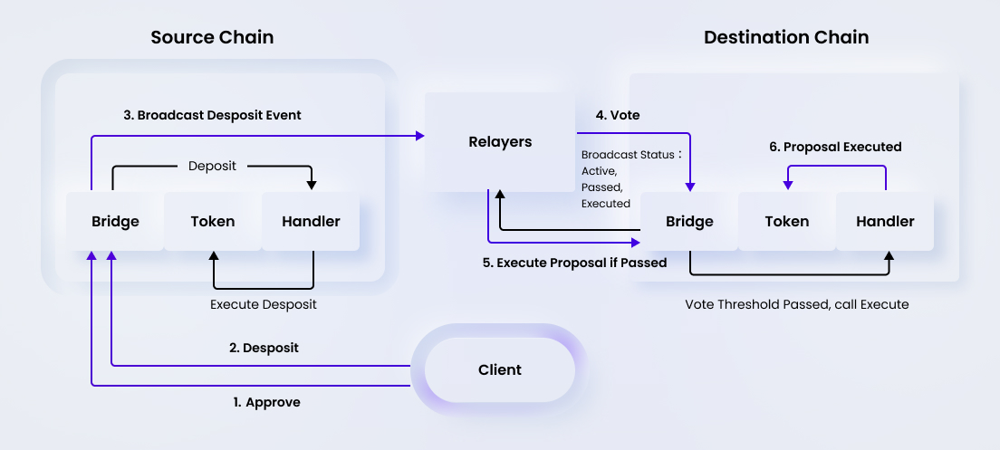

# Overview

import useBaseUrl from '@docusaurus/useBaseUrl';

The Rialto bridge is Findora’s homegrown solution for moving assets between blockchains. Built on Chainsafe’s Chainbridge infrastructure, burnished and strengthened by Findora, it allows technologically different chains to communicate with each other, perform transactions against each other and settle balances at the end of a session. Let’s dive in.

At a high level, Rialto’s architecture involves a source chain, a destination chain, and relayers, with the first two having smart contracts that handle the heavy lifting involved with communication between the chains. The relayer in this matrix of communication handles the message sending and only that. When the request hits the destination chain, then the equivalent value of the coins are minted and they’re ready for use. There is more going on, let’s look at what this looks like at a lower level but first, connect your wallet.

## Architecture and definitions

- Client - Where the Deposit and Approver requests come from
Source Chain - The beginning of a transaction
- Relayers - the message system for passing information from the source to the destination
- Destination Chain - the end chain of the transaction

## Contracts and definition

- Bridge contract - The contract interacts with the client and the relayers. It receives calls from the client, and based on the type of call, delegates the locking or minting of the coin in the token contract through the Handler contract
- Token contract - This contract token itsef
- Handler contract - The contract that handles executing deposits or withdrawals

## Schematics

## Source Chain

### Approvals and Depositing into the Source Chain

- The client makes two calls to the source chain, one to approve and the other to deposit. The approval hits the bridge contract, and when that is passed, the next port of call is the handler contract.

- This executes the deposit and then calls for the client to make the deposit into the token contract of the source chain

## Destination Chain

### Stages for Relayer voting

- Active - The proposal for getting assets minted on the destination chain is submited
- Passed - Relayers overwhelmingly agree on proposal
- Executed - Destination chain mints equivalent value of incoming message request from source chain
- Cancelled - The proposal is declined

### Voting and Minting on the Destination Chain

- After the deposit hits the token contract, a deposit event is triggered that passes the message to the relayer, and the relayer itself broadcasts this information to the bridge contract of the destination chain. Then a vote happens on the proposal.
- Voting on the destination chain means that relayers get the proposal and initiate a process where every one of them votes. With every vote from a relayer, the broadcast status moves through the different stages from active to executed.
- The executed stage is passed and finally the bridge calls the handler contract that eventually moves the data to the tToken for minting
