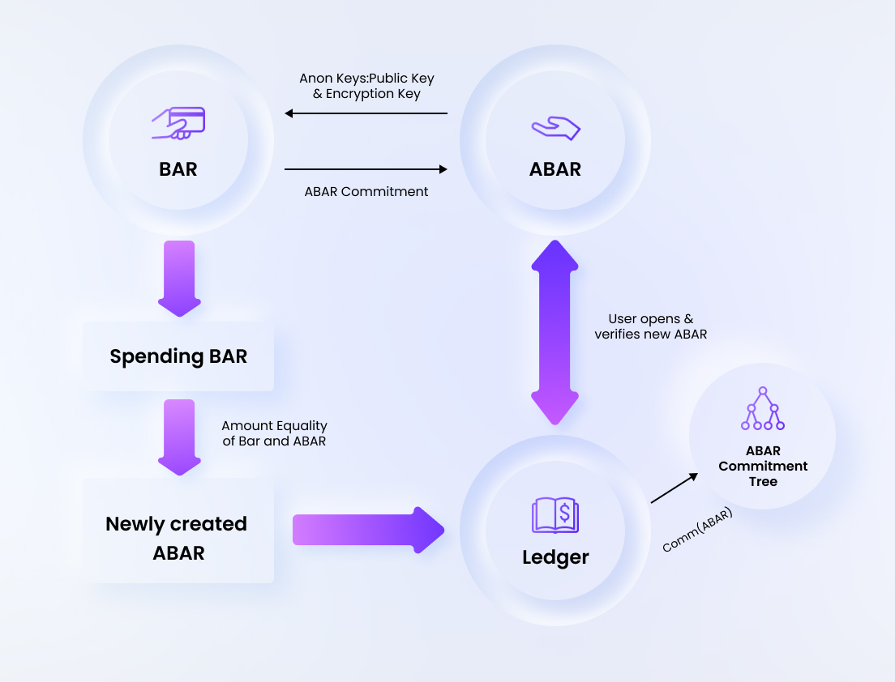
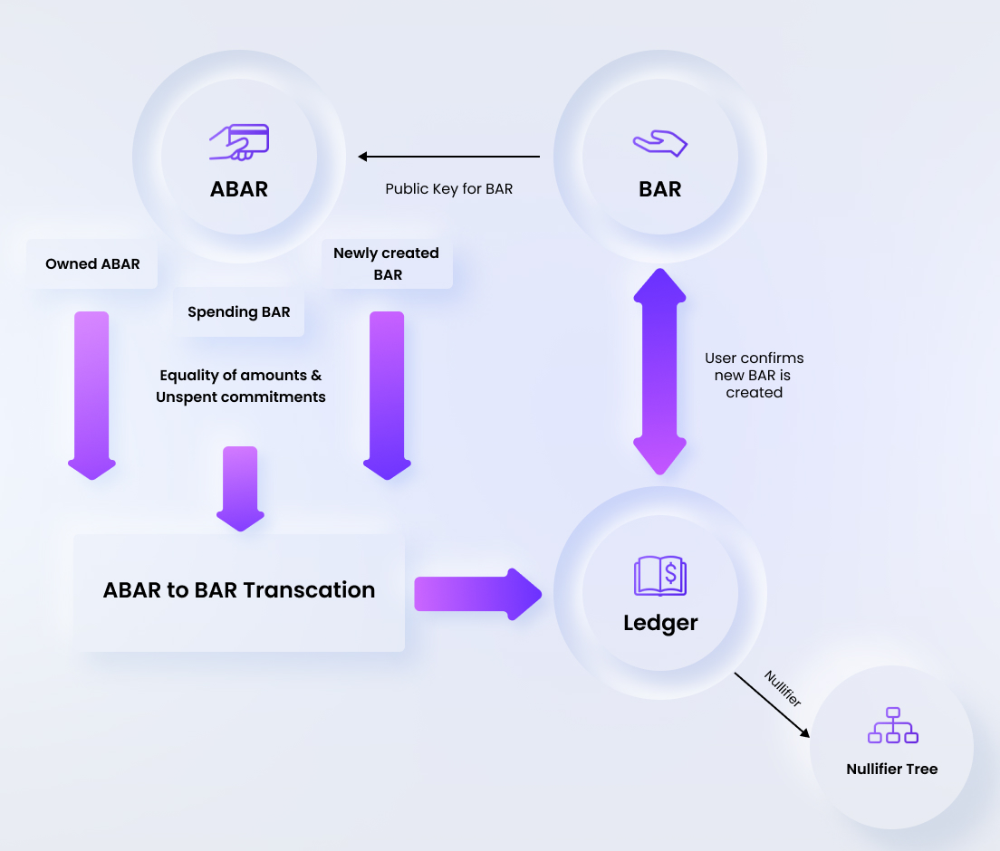

# Concepts 

## BAR <--> ABAR Conversions

A Blind Asset Record (called as BAR) is used to issue and transfer assets and is the basic building block of the non-anonymous payments on Findora network's UTXO chain. This means the owner of a BAR is not anonymous, but merely pseudonymous, similar to most of the open blockchains in existence. BAR is a data structure that is composed of the public key, amount and the asset type. In the case of confidential payments, the amount and asset type could be hidden but not the public key. So for the purpose of anonymity and hiding the identities from the ledger, we need another data structure and that is the Anonymous Blind Asset Record (called as ABAR). ABAR is a data structure which only contains the cryptographic commitment to the amount & asset type, and the owning public key lies on a dense merkle tree as a version verifiable accumulator.
<!--- is the randomized version of the owning public key with the randomizer unknown to the network. -->

```rust
// Amount and asset type can be confidential or non confidential

pub struct BlindAssetRecord {
    pub amount: XfrAmount,        // Amount being transferred
    pub asset_type: XfrAssetType, // Asset type being transferred
    pub public_key: XfrPublicKey, // ownership address
}
```
```rust
pub struct AnonBlindAssetRecord {
    pub commitment: BLSScalar,
}
```

### BAR to ABAR
To perform an anonymous transfer, we need to possess an ABAR either by receiving it from another sender or by converting a BAR that we own to an ABAR. This step of converting the tokens/coins from BAR to ABAR can be done using,
1. An unspent BAR (identified with TxoSID) with a valid of possession of ownership keys, and
2. Anon Keys to which the ABAR ownership is to be assigned
<!--- ABAR consists of the cryptographic commitment to the amount along with the randomized public key, which is unique to each transaction. The BAR to ABAR operation returns a randomizer aka the diversifier, which is required for further transfers as the randomized public key which gets stored on the ledger through the ABAR is obtained only from the randomizer and the anonymous (non-randomized) public key of the user.-->

The unspent status and the owner's public key of a BAR lies on the public node as a set and is derived by replaying all the transactions. When a BAR is spent to create ABAR, we provide the integer id of the BAR (TxoSID) and a signature corresponding to the public key on the ledger. The equality of the amount and asset type in the BAR and ABAR is proved separately. The ABAR is associated to a *spending key*, which is a private key that can be used to spend ABARs sent to its corresponding public key. These set of keys required for the anonymous transfers are represented with an Anon Keys data structure. The AXfr Secret Key is a keypair associated with spending of the ABAR while Decryption Key is a secret key that is used to encrypt or decrypt the Owner Memo (the HMAC of the owner).

```rust
pub struct AnonKeys {
    pub axfr_secret_key: AXfrKeyPair,
    pub axfr_public_key: AXfrPubKey, // can be obtained from AXfrKeyPair
    pub enc_key: XPublicKey, // can be obtained from XSecretKey
    pub dec_key: XSecretKey, 
}
```


The BAR to ABAR operation generates an ABAR along with a transaction id (called ATxoSID) which similar to TxoSID for BAR. This operation returns the commitment which should be securely stored to spend the newly generated ABAR in future. The Findora wallet application shows the updated balance in the anonymous wallet, but if CLI is used, the ownership of the ABAR can be confirmed by "opening" the ABAR, which is essentially opening the commitment with the AXfr Secret Key and Decryption Key. This opened ABAR consists of amount, asset type, axfr public key, owner memo and the merkle root value.

```rust
pub struct OpenAnonBlindAssetRecord {
    pub amount: u64,
    pub asset_type: AssetType,
    pub blind: BLSScalar,
    pub pub_key: AXfrPubKey,
    pub owner_memo: Option<OwnerMemo>,
    pub mt_leaf_info: Option<MTLeafInfo>,
}
```

### ABAR to BAR

ABAR to BAR conversion is nothing but spending an owned ABAR and generating a new BAR. We need to present the commitment of the ABAR, the Anon Keys and the keys for receiving the BAR. The ATxoSID obtained from the unique commitment exposes which ABAR is being spent.

This spending of the ABAR is similar to that of an Anonymous Transfer i.e., a zero knowledge proof is generated to prove,
1. The existence and ownership of ABAR and
2. The equality of the asset amount & asset type in the ABAR to BAR conversion

The existence and ownership of ABAR is proved with the knowledge of the secret key and the correctness of the merkle path of ABAR in the commitment tree. The network verifies the proof with the merkle root and the exact spending of the ABAR remains a secret. To ensure that there is no double spending involved, the spender creates an HMAC like nullifier hash from the amount, asset type and the public key, with the HMAC secret derived from the secret key of the owner. The Nullifier Hash cannot be correlated to any ABAR in the commitment tree. The nullifier hash is stored in another tree (called the nullifier set) to track the common set of nullifiers, signifying all the spent ABARs in the network. The correctness of the nullifier hash is proved in zero knowledge to not allow anybody to forge a Nullifier.



This operation returns a new BAR with the same amount as that of the ABAR. Optionally, the amount and asset type could be made confidential while generating the new BAR. However the public key of the BAR is not anonymous anymore, hence the ABAR to BAR conversion assumes a loss in anonymity for the transfers made any further using the newly generated BAR.

## Anonymous (ABAR) Transfer

One goal for Findora's design is to provide anonymity with shielded or private transactions. Shielded values are carried out by ABARs and are the fundamental building blocks with which the transaction for anonymous transfers is created. For each ABAR that is validated, there is an associated ABAR commitment with a fixed position in a Merkle tree of ABAR commitments. The commitments to the output ABARs are revealed to allow them to be spent in the future. Findora uses a 3-ary Merkle tree built with the ”Snark-friendly” *Rescue* hashing algorithm for this purpose.

The ABAR is also associated to a unique nullifier in order to prevent double spends. Computing the nullifier requires the associated private spending key and it is infeasible to correlate the ABAR commitment or the ABAR position to a nullifier without the knowledge of this private key. A valid unspent note, at a given point on the blockchain, is one for which the ABAR commitment has been publicly revealed prior to that point but the associated nullifier has not. This is the intuition why the nullifier is important to prevent double spending. The *nullifier set*, i.e. the set of all nullifiers revealed up to that point, is stored as a Merkle tree. Findora uses a binary sparse merkle tree built using the SHA-256 hashing algorithm for this purpose. Sparse Merkle trees allow for efficient non-membership proofs, which makes them suitable for storing the nullifier set. The nullifiers of the input ABARs are revealed to prevent them being spent again.

Findora uses the increasingly popular TurboPlonk instantiated with the Kate/KZG polynomial commitment scheme as the zk-Snark that enables this mechanism. Plonk is a pairing-based Snark with a universal and updateable trusted setup whereas *TurboPlonk* is an optimization of Plonk with customized gates. While making an anonymous transfer, an ABAR record is spent and a new one is created addressed to the new owner. The spender of the ABAR presents a zero knowledge TurboPlonk proof of the existence and ownership of ABAR, that all of the following hold except with negligible probability,

For each ABAR input:

* There is a revealed value commitment to the same value as the input ABAR
* The Prover knows the proof authorizing key of this ABAR
* The nullifier and the ABAR commitment are correctly computed

For each new ABAR output:

* There is a revealed value commitment to the same value as the output ABAR
* The ABAR commitment is computed correctly
* It is infeasible to cause the nullifier of the ABAR output to collide with the nullifier of any other ABAR

 Transfer.jpg)

### Sequence of steps in ABAR Transfer

1. The Receiver generates Axfr Secret Key and the Decryption Key as part of the Anon Keys.

2. The Receiver then generates Axfr Public Key and Encryption Key from the keys in Step 1 and sends them to the Anon Transfer Sender through some external private channel i.e., it's not recorded on the ledger.

3. The Sender opens an ABAR which he has ownership of, and creates a new ABAR assigning the ownership to the Axfr Public Key of the receiver. The asset type and the amount are hidden in an owner memo which is encrypted with the Receiver's Encryption key.

4. The Sender then submits the anonymous transfer transaction to the ledger along with the zero knowledge proof for the valid spending of input ABAR (the knowledge of the secret key and the correctness of the merkle path). A non membership proof is also generated for the nullifier to prove that the ABAR is unspent.

5. The ledger verifies the zero knowledge proof to confirm the valid spending of sender’s ABAR and adds the nullifier to the nullifier set, while the commitment to the new ABAR is added to the ABAR commitment tree.

6. The Sender receives the confirmation of the transaction from the network in the form of a note, and shares the ABAR commitment to the receiver through private channels.

7. The Receiver queries the ledger for the newly owned ABAR by using the commitment shared by the sender, and gets the corresponding transaction. The transaction ID (ATxoSID) and commitment corresponding to this ABAR are stored for future spending.

8. The Receiver can optionally open the ABAR with the Axfr private key and decrypt the owner memo with the decryption key, to confirm the amount and asset type.


<!---  -->
<!---  -->
<!---  -->
<!---  -->
<!--- 3. The Sender generates a commitment using the AXfrPublicKey that was sent by the receiver in Step 2 and uses it later to submit a transaction to the ledger. So, the sender also indirectly creates the owner memo with which the receiver opens the ABAR since ABAR contains the AXFR Note and AXFR Note contains the AXFR Body which in turn contains the owner memo. -->

<!--- 7. The Receiver generates the randomized public key from his private key in step 1 and randomizer from step 5.-->
<!--- 9. The Receiver wallet saves the TxoSID of the ABAR and commitment combination as a unspent anonymous asset in the local database.
9. In the future, the Receiver is a potential new sender and utilizes his now opened ABAR as in Step 8 to generate a new transaction with the nullifier (Step 3). -->